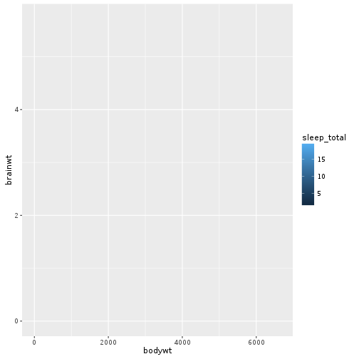
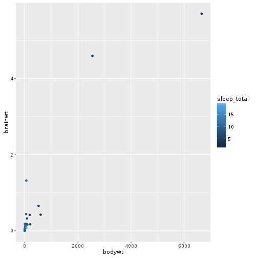
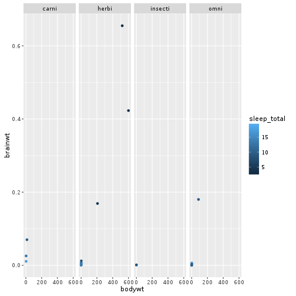
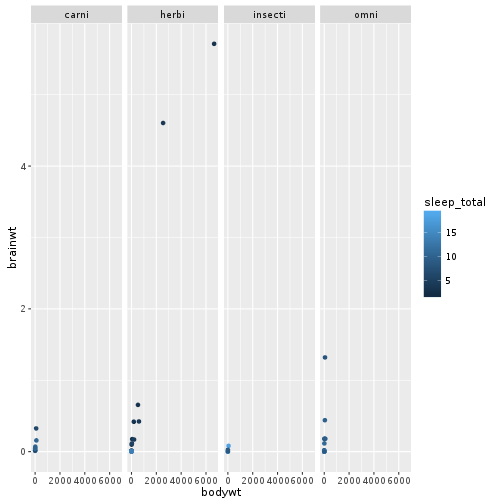
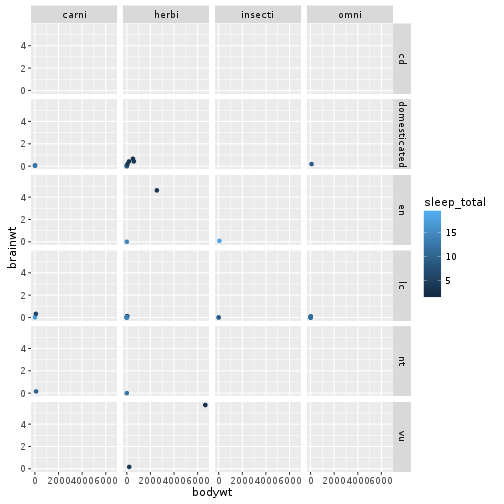
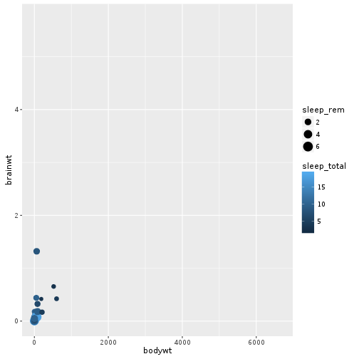

# Introduction to ggplot2

<!--sec data-title="Learning Objectives" data-id="obj" data-show=true data-collapse=false ces-->

* to learn the basic layers of a ggplot figure
* to create a basic scatter plot 
* to use a faceting layer

<!--endsec-->

 

---

**Table of Contents**

<!-- toc -->

 

---

## Introduction

Plotting our data is one of the best ways to quickly explore it and the various relationships between variables.

There are three main plotting systems in R: 

1. the [base plotting system](http://www.statmethods.net/graphs/)

2. the [lattice package](http://www.statmethods.net/advgraphs/trellis.html)

3. the [ggplot2 package](http://www.statmethods.net/advgraphs/ggplot2.html)

Today we'll be learning about the ggplot2 package, because it is the most effective for creating publication quality graphics.

 

---

## Installation

Make sure that you have the most recent version of R to get the most recent version of ggplot.

~~~sourcecode
install.packages("ggplot2")
library(ggplot2)
~~~

 

---

## The grammar of graphics

ggplot2 is built on the grammar of graphics, the idea that any plot can be expressed from the same set of components: a data set, a coordinate system, a mapping from from data to aesthetic attributes (such as size, colour and shape) and a set of geoms--the visual representation of data points (such as points, lines and bars).

The key to understanding ggplot2 is thinking about a figure in layers: just like you might do in an image editing program like Photoshop, Illustrator, or Inkscape. These layers can be added together using a `+` symbol.

<!--sec data-title="Tip: Printing plots" data-id="tip2" data-show=true data-collapse=true ces-->

When using R in interactive mode (running lines of code as opposed to sourcing a file), a call to ggplot will result in a plot being drawn. However, when sourcing a code file, ggplot figures will not be plotted unless there is a call to print. Make sure to assign your figure to a variable and then print that variable if you want your plot to appear! 

<!--endsec-->

 

---

## The `msleep` dataset

Let's explore these layers using the `msleep` dataset that comes with the `ggplot2` package. The `msleep` dataset describes the sleep properties of different mammals. The dataset contains 11 columns:
* `name` - the common name of the mammal
* `genus` - the mammal's genus
* `vore` - herbivore, carnivore, insectivore or omnivore
* `order` - the mammal's order
* `conservation` - the conservation status of the mammal
* `sleep_total` - total amount of sleep in hours
* `sleep_rem` - total amount of rem sleep in hours
* `sleep_cycle` - length of a single sleep cycle in hours
* `awake` - amount of time spent awake in hours
* `brainwt` - brain weight in kilograms
* `bodywt` - body weight in kilograms

 

---

## The ggplot layer

The creation of a ggplot graphic begins with a call to the `ggplot` function. This function lets R know that we're creating a new plot, and specifies the global options for the plot: they apply to all layers on the plot.

~~~sourcecode
ggplot(data = msleep)
~~~

So far, we have told `ggplot` which dataset to use for the plot. Since we have given no additional information, `ggplot` has created the plotting area and nothing else.

 

---

## The aesthetic function

The aesthetic function - `aes` - is called within the `ggplot` and `geom` layers. The `aes` function allows mapping from the dataset to the aesthetic features of the plot. When called from within the `ggplot` layer, the `aes` attributes are applied globally to all layers of the plot. Whereas, when called from within the `geom` layers, the `aes` attributes are only applied to the current layer.

<!--sec data-title="Tip: Using the aesthetic function" data-id="tip1" data-show=true data-collapse=true ces-->

If you're unsure whether something belongs in the `aes` function, ask yourself whether it includes a column name from the dataset. If it includes a column name, then it belongs in the `aes` function.

For example, if you want to colour everything red, the command to colour does not need to appear in the `aes` function. However, if you want to colour by the `vore` column of the dataset - so that omnivores, carnivores, insectivores and herbivores are each coloured by separate colours - the colour command should appear in the `aes` function.

<!--endsec-->

<!--sec data-title="Tip: Referencing column names" data-id="tip4" data-show=true data-collapse=true ces-->

Normally in R when you reference a column name, you need to tell R which dataset to use, e.g. `x = msleep$bodywt`. This is not necessary in `ggplot`, as the dataset is defined up front (`data = msleep`) and so column references do not require respecification of the dataset! E.g. `x = boddywt`

<!--endsec-->

The `aes` function takes arguments such as `x`, `y`, `by`, `colour`, `fill`, `alpha`, `shape`, `weight` and `size`. What happens when we add an `aes` function call to the `ggplot` layer?

~~~sourcecode
ggplot(data = msleep, 
       aes(x = bodywt, y = brainwt, colour = sleep_total))
~~~

`ggplot` now knows which scales to use for the x- and y-axes. But we still haven't told `ggplot` what to plot. For this we need the `geom` layers.

<!--sec data-title="Tip: Colouring by categorical variables" data-id="tip5" data-show=true data-collapse=true ces-->

Within the `aes` function, you can set the colour of the geometric components of your plot. If the column used to set the colour is a numeric vector, the default colouring will be a gradient along the blue spectrum. If, however, the column used to set the colour is a factor (AKA categorical), the resultant plot will have separate colours for each level of the factor. There are times when you may want to convert from a numerical vector to a factor for this specific purpose!

<!--endsec-->

<!--sec data-title="Tip: American or British spelling" data-id="tip6" data-show=true data-collapse=true ces-->

You may have noticed that the British spelling of colour was used above. The ggplot2 package was created by a New Zealander - statistician, Hadley Wickham - and is capable of handling both the British and American spelling.

<!--endsec-->

 

---

## The geom layer

The `geom` layer tells `ggplot` what type of plot to create. Some possible `geom` layers include:
* `geom_abline` - horizontal or vertical lines specified by slope and intercept 
* `geom_bar` - rectangle bars with bases on the x-axis
* `geom_bin2d` - heatmap of 2-dimensional frequency data
* `geom_boxplot` - box and whiskers plot
* `geom_contour` - draw contours of a 3-dimensional surface in 2 dimensions
* `geom_density` - draw a smooth density estimate for a single variable
* `geom_errorbarh` - draw horizontal error bars
* `geom_jitter` - scatter plot with points jittered to reduce overlap betweej points
* `geom_label` - add textual annotations
* `geom_point` - draw a scatterplot
* `geom_polygon` - draw a filled path
* `geom_smooth` - add a smoothed conditional mean according to a statistical smoothing method
* `geom_violin` - draw a violin plot

~~~sourcecode
ggplot(data = na.omit(msleep), 
       aes(x = bodywt, y = brainwt, colour = sleep_total)) +
  geom_point()
~~~

Here we have created a scatter plot of brain weight against body weight, coloured by the total number of hours sleep per night. 

<!--sec data-title="Challenge 1" data-id="ch1" data-show=true data-collapse=false ces-->

Modify the above code so that the size of the symbols is dictated by the number of hours of REM sleep.

<!--endsec-->

<!--sec data-title="Tip: Adding layers to an already assigned variable" data-id="tip3" data-show=true data-collapse=true ces-->

Layers can be added after assigning a variable name. This makes it easy to build up plots without having to create a single long line of code. Here is an example created by modifying the code used above.

~~~sourcecode
p <- ggplot(data = na.omit(msleep), 
       aes(x = bodywt, y = brainwt, colour = sleep_total)) 
p <- p + geom_point()

print(p)
~~~

<!--endsec-->

 

---

## Faceting

Faceting is an additional layer that can be used to display different segments of the data in separate panels. `facet_grid` lays out panels in a grid, while `facet_wrap` wraps a 1-dimensional ribbon of panels into 2 dimensions. 

Faceting layers take a formula as their argument. Formulas are defined using the `~` symbol. When using the `facet_grid` layer, the variables on the left hand side of the `~` specify the rows and the variables on the right hand side of the `~` specify the columns. Multiple variables can be added to either side of the `~` by comibing them with the `+` symbol.

Let's modify the previous code to add a faceting layer, so that we have separate panels for each of the different eating habits. Use the `na.omit` function to get rid of empty cells before faceting.

~~~sourcecode
ggplot(data = na.omit(msleep), 
       aes(x = bodywt, y = brainwt, colour = sleep_total)) +
  geom_point() + 
  facet_grid(~ vore)
~~~

Now let's create separate panels for each of the different eating habits and for each of the different conservation statuses.

~~~sourcecode
ggplot(data = na.omit(msleep), 
       aes(x = bodywt, y = brainwt, colour = sleep_total)) +
  geom_point() + 
  facet_grid(conservation ~ vore)
~~~

<!--sec data-title="Challenge 2" data-id="ch2" data-show=true data-collapse=false ces-->

Modify the above code to use `facet_wrap` instead of `facet_grid`. How did the plot change? In your opinion, which layer gave a better visualisation of the current data?

<!--endsec-->

 

---

## Challenge solutions

<!--sec data-title="Solution to Challenge 1" data-id="ch1sol" data-show=true data-collapse=true ces-->

~~~sourcecode
ggplot(data = na.omit(msleep), 
       aes(x = bodywt, y = brainwt, colour = sleep_total, size = sleep_rem)) +
  geom_point()
~~~

<!--endsec-->

<!--sec data-title="Solution to Challenge 2" data-id="ch2sol" data-show=true data-collapse=true ces-->

`facet_wrap` creates a vector of plots that is wrapped across multiple rows. `facet_grid` creates a grid of plots, with the column name on the right hand side of the `~` dictating the horizontal axis of the grid and the column name on the left hand side of the `~` dictating the vertical axis of the grid.

~~~sourcecode
ggplot(data = na.omit(msleep), 
       aes(x = bodywt, y = brainwt, colour = sleep_total)) +
  geom_point() + 
  facet_wrap(conservation ~ vore)
~~~

<!--endsec-->
