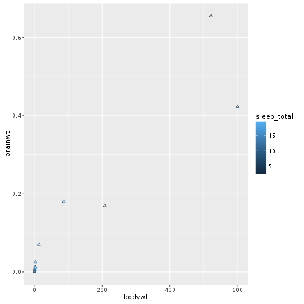

# Customising ggplot figures

<!--sec data-title="Learning Objectives" data-id="obj" data-show=true data-collapse=false ces-->

* to fill in later

<!--endsec-->

 

---

**Table of Contents**

<!-- toc -->

 

---

## Customising your ggplot

So far you have learnt the basic structure of a plot, and how to map from the dataset to the aesthetic features of the plot. In this section you will learn how to change the aesthetic attributes of the plot that do not map onto the dataset.

 

---

## Changing the features of the geometric layers

Needs to include changing symbol borders and colours, size, shape, 
line width (fill vs colour)

<!--sec data-title="Challenge 1" data-id="ch1" data-show=true data-collapse=false ces-->

~~~sourcecode
ggplot(data = na.omit(msleep), 
       aes(x = bodywt, y = brainwt, colour = sleep_total)) +
  geom_point()
~~~

Modify the above code to display triangular symbols in the scatterplot, instead of circles.

**HINT:** Use the shape argument in the `geom_point` layer, which takes an integer value. Circles are created using shape = 1. 

<!--endsec-->

 

---

## Colour schemes

How to change the colour scheme

 

---

## Altering the legend

legend location, title and names

 

---

## Plot annotations

 

---

## Modifying the plot axes and tick marks

 

---

## Changing the plot background and grid lines

 

---

## Adding a plot title and axis labels

 

---
Themes control non-data components of the plot.

 

---

## Challenge solutions

<!--sec data-title="Solution to Challenge 1" data-id="ch1sol" data-show=true data-collapse=true ces-->

~~~sourcecode
ggplot(data = na.omit(msleep), 
       aes(x = bodywt, y = brainwt, colour = sleep_total)) +
  geom_point(shape = 2)
~~~

<!--endsec-->
